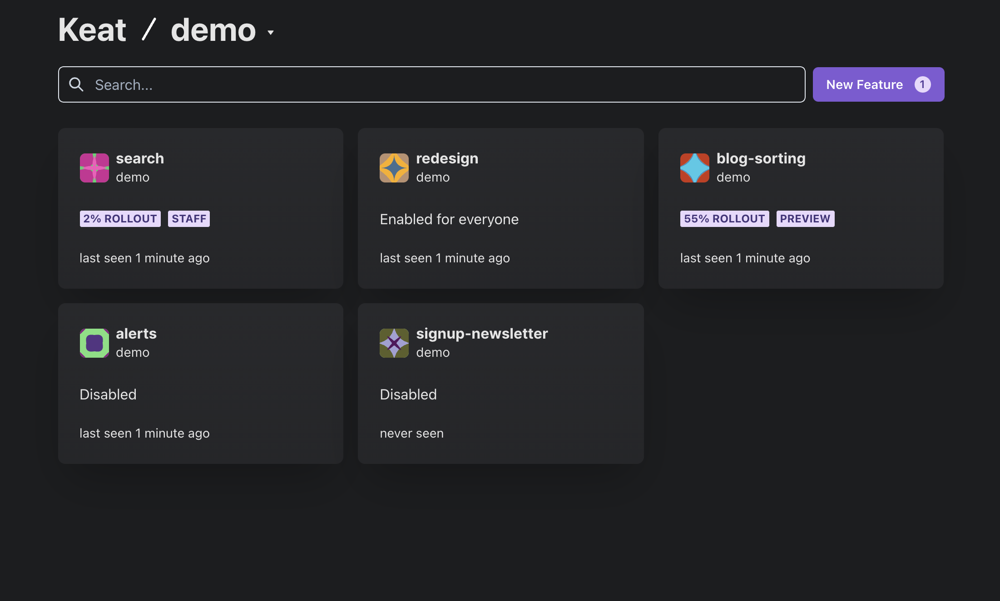
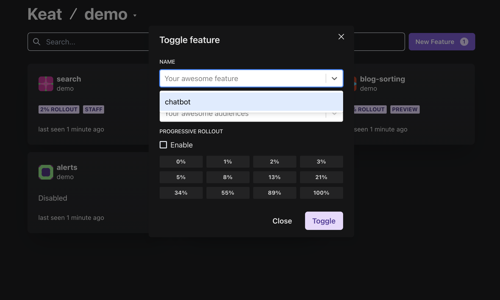
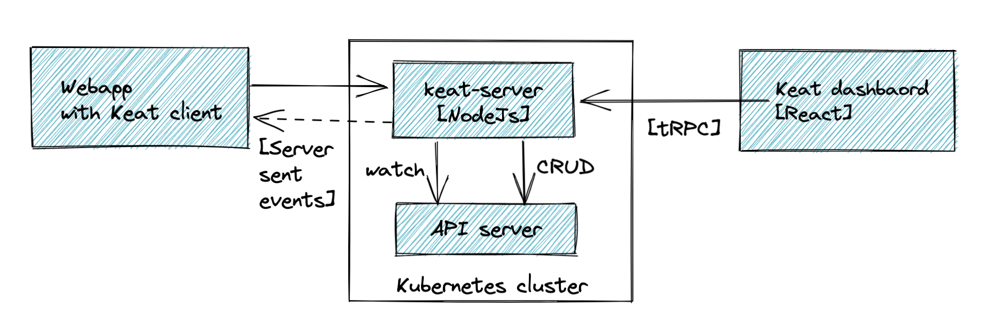

# Keat

Keat is the Kubernetes-native feature management tool.

**Problem:** "I want to increase my deployment frequency while keeping control of my stability."

**Solution:** Put your new code behind feature flags, which is safe to deploy. Afterwards gradually increase the reach and recover from failures within minutes.

## Installation

Install Keat server:

```bash
kubectl create namespace keat
kubectl apply -n keat -f https://raw.githubusercontent.com/WitoDelnat/keat-server/stable/k8s/install.yaml
```

This will add custom resource definitions and create a new namespace, keat, where Keat server will live.

## Getting started

Define your application:

```yaml
# application-demo.yaml
apiVersion: keat.io/v1alpha1
kind: Application
metadata:
  name: demo
spec:
  search: 100
  chatbot: ["staff", 25]
```

Apply it:

```bash
kubectl apply -n keat -f ./application-demo.yaml
```

That's it! You're all setup to [remotely configure your Keat client][keat-node].

## Dashboard

Keat-server comes with a dashboard to conveniently create and update Kubernetes resources. It comes with suggestions for features and groups by inspecting connecting clients.




## How does it work?

Keat-server is a simple remote configuration tool. The idea is to keep the data model trivial and store it within a Kubernetes resource to avoid the need of a database. Besides that, the API server's _watch_ capability in combination with server-send events allows us to easily stream changes in real-time.



Since configuration are plain Kubernetes resources, you can use any of the tools you are familiar with to build workflows that works for you. For instance, manage feature flags through kubectl, k9s or Argo CD. But you could also add a rollback mechanism by manipulating the Kubernetes resource based on Prometheus metrics.

## Coming next

The server is ready to be split into two pods, _keat-proxy_ and _keat-server_, to add the necessary security and scalability for production workloads.

[keat-node]: https://github.com/WitoDelnat/keat
